# corfu-pixel-perfect

corfu-pixel-perfect allows the use of variable fonts, emojis and images in Corfu
while still maintaining perfect pixel alignment of the popup content with
virtually no performance degradation in real life.

## Why?

As software professionals, the completion popup is one of the most important UI
elements in an editor, we look at it probably as much as we look at the code
itself. However, we are also Emacs users, and historically the Emacs ecosystem
has a tendency to use one single monospaced font for both the UI and the text
documents for no better reason than "I occasionally use Emacs in the terminal",
or "that's something every package forces on me". While I can't possibly comment
on your life choices, I claim your font choice need not be an all-or-nothing
binary choice (since Emacs 29).

But why would you like to use anything other than a monospaced font? I hear you
ask.

I very much like monospaced fonts, in fact I like them so much, I'd like to use
more than one kind of monospaced fonts, or a different width or slant variant of
the same monospaced font, or occasionally commit the sin of using a variable
font for the less important things such as annotation. Unfortunately, even in
2024, these font choices are still impossible to use in many Emacs packages,
because they still carry the baggage from treating every glyph as having the
exact same size, one such example is `corfu`.

Would you rather have this?

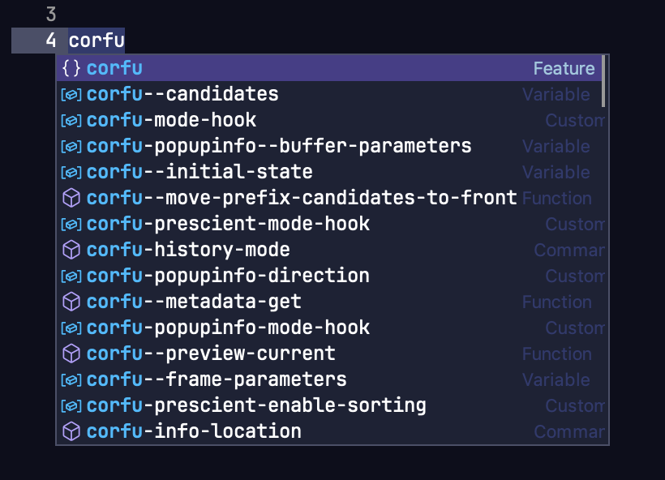


Or something like Intellij's?

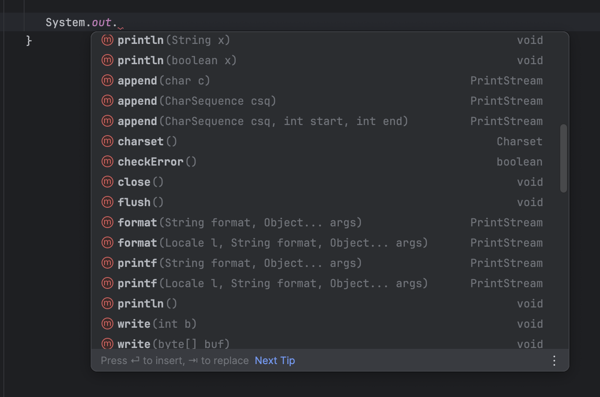


With `corfu-pixel-perfect`, you can finally have perfect pixel alignment in your
favorite auto-completion popup.


## Usage

``` emacs-lisp
(use-package corfu)
(use-package corfu-pixel-perfect
 :quelpa (corfu-pixel-perfect :fetcher github :repo "wyuenho/emacs-corfu-pixel-perfect")
 :after (corfu)
 :hook (global-corfu-mode . corfu-pixel-perfect-mode))
```


## Problems solved

### Prefix icon misalignment due to the icons having different widths than the default face font

| corfu | corfu-pixel-perfect |
|-------|---------------------|
|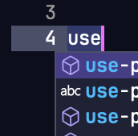|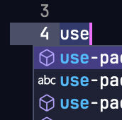|


### Variable fonts causes misalignment of the annotations and the scroll bar

| corfu | corfu-pixel-perfect |
|-------|---------------------|
||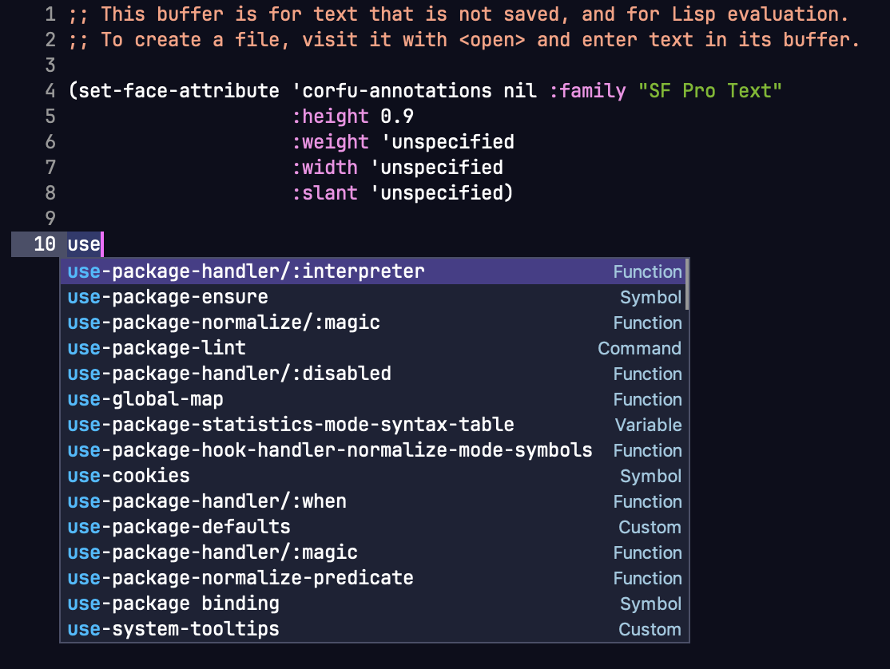|


### Emoji causing misalignment due to font width differences

| corfu | corfu-pixel-perfect |
|-------|---------------------|
|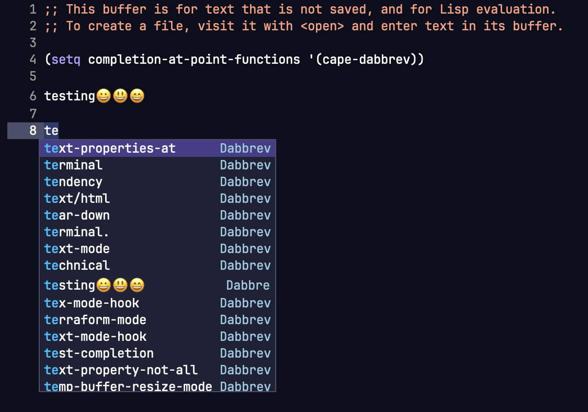| [^1]|


### Misalignment of right margin and missing scroll bar due to faces using different widths

| corfu | corfu-pixel-perfect |
|-------|---------------------|
|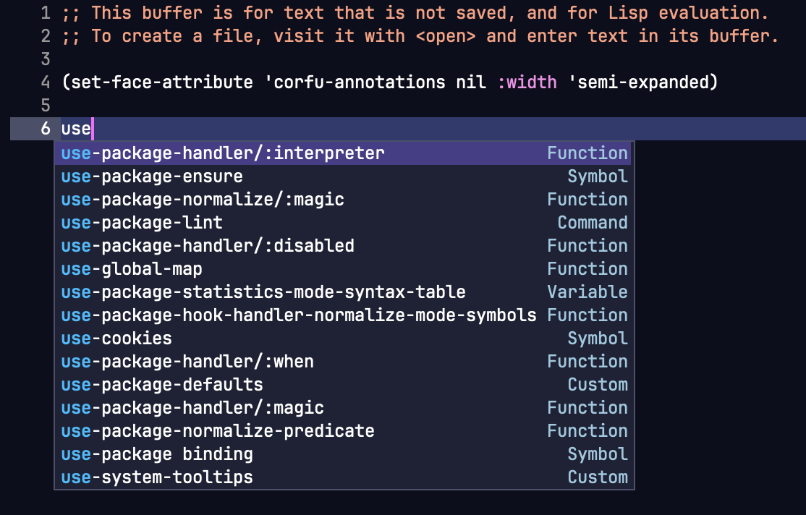|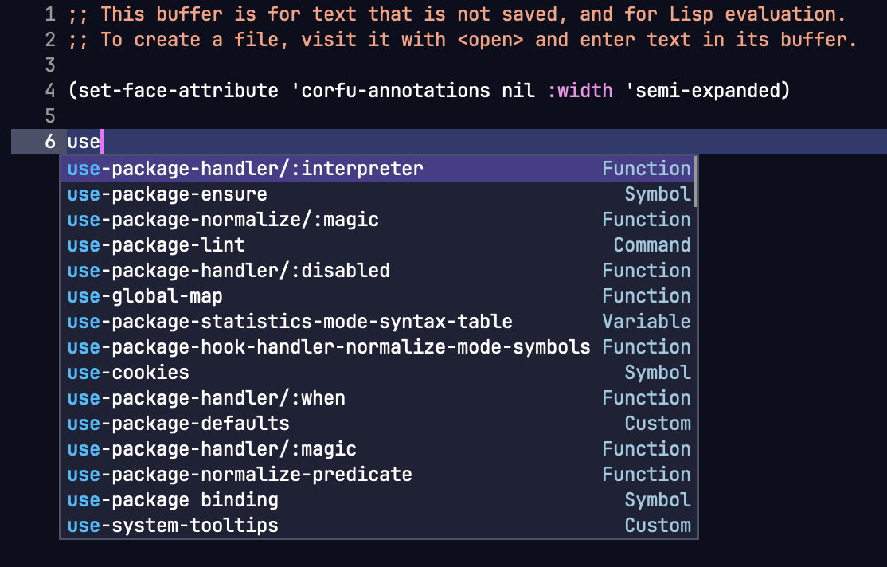|


### Misalignment of right margin and missing scroll bar due to faces using different slants

| corfu | corfu-pixel-perfect |
|-------|---------------------|
||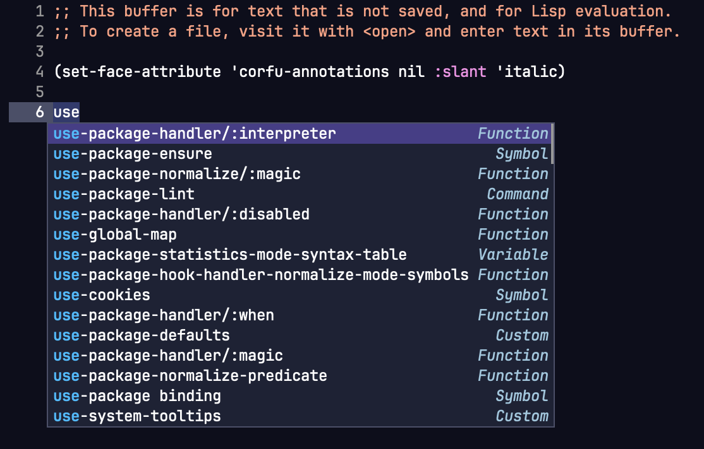


[^1]: The height is still misaligned due to a similar treatment as default font width to line height, this will probably be addressed at a later time.


## New Features

### Ellipsis to indicate additional text being clipped

Currently `corfu` does not offer users any indication when the completion text
is truncated. This presents a usability problem when your `corfu-max-width`
happens to land around where the candidates end.


| corfu | corfu-pixel-perfect |
|-------|---------------------|
||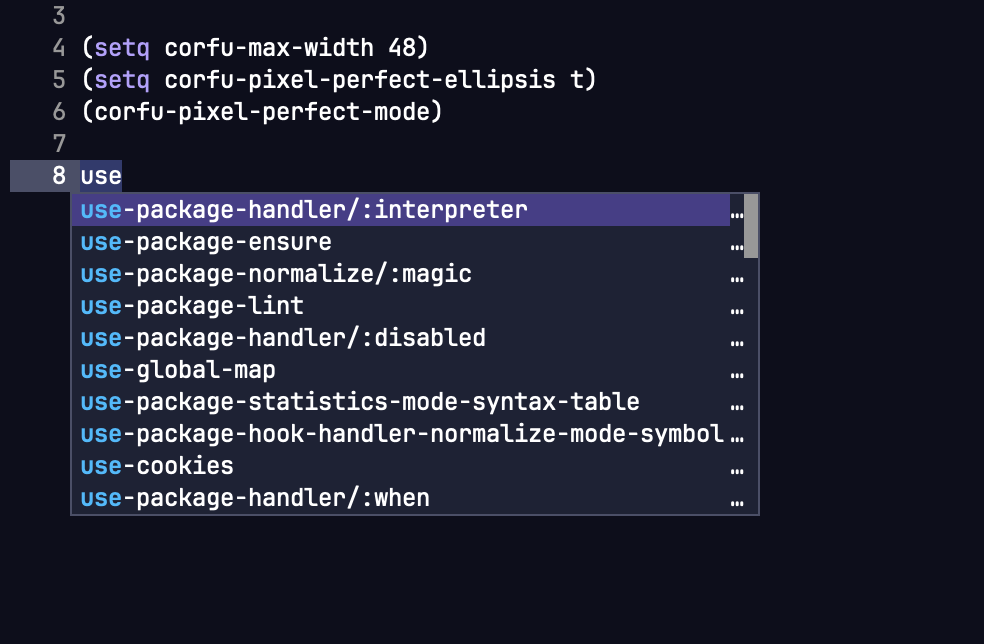

Just set `corfu-pixel-perfect-ellipsis` to `t` to enable the new behavior with
the same performance.

As a sidenote, this option will necessitate moving the scroll bar to the margin,
which has a minimum width of 1 column. This is a tradeoff between usability,
performance and beauty. I chose to give up beauty on this one.

As to the column of ellipsis, coming from outside of Emacs, this may seem
strange to you, and I agree, but this behavior is at least somewhat consistent
with Emacs's default behavior. Emacs shows a whole column of bitmap right arrows
on a GUI and ellipsis on the terminal when clipping a table of padded text. Let
me know if you hate it, I think there's enough performance headroom in the usual
case to make the ellipsis less intrusive.


## Future improvements

### Much simpler terminal mode

Currently, due to how `corfu` programmatically truncates strings, downstream
packages or user customizations, even in situations where every glyph has
exactly the same width, may still exhibit surprising effects such as this:

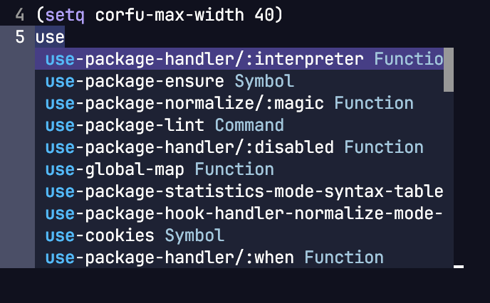


The above screenshot was captured using
[`corfu-terminal`](https://codeberg.org/akib/emacs-corfu-terminal). While some
may argue this is useful, I would content this is very distracting, especially
in cases where the annotations do not contain much useful information and can
reasonably be clipped.

There is a plan to offer a much simpler `corfu-pixel-perfect-terimal-mode`
tailored to uniform glyph width situations while respecting the API signatures
and the constraints upstream, stay tuned.


### Column-wise truncation

The text inside the completion popup is basically a table of 3 columns - prefix,
candidate, and annotations. Given the individual cell contents can differ in
length wildly, and differ in significance, always truncating from the end of the
annotations may not suit every situation. This is especially true when working
in a statically typed programming language such as Rust or TypeScript in LSP
mode. The signature of a function is often just as, if not more important than
the name. If a few overly long functions such as
`myComponetSuperSecret__DangerouslySetInnerHTML` causes the candidate column to
suddenly increase in width greatly, the function signatures may overflow behind
the window due to `corfu-max-width` being exceeded. It is perhaps preferrable to
first truncate the candidates in this situation.


### Truncation indicator other than a column of ellipsis

While `corfu-pixel-perfect-ellipsis` tells you the completions text are clipped
behind the window, it's also rather intrusive. I think *some* indicator for
clipped text is needed, but it doesn't need to be a column of ellipsis. Let me
know if you have some idea on how best to present this in the popup.


### Intelligent popup width adjustment

Currently `corfu-min-width` defaults to 15, which is too low for most cases, and
`corfu-max-width` defaults to 100, which is too large for most cases. So, for
most cases, the popup width flickers wildly between 85 columns as you scroll,
depending on which programming languages you work with. However, since different
programming languages differ in verbosity, you don't really know what the best
widths to set are, so you end up constantly messing with these width
variables. This situation is exacerbated by the fact `corfu` does not remember
the size after resizing the popup with a mouse.

There must be some simple clever math you can do to guess a sensible static
width depending on the major mode and past completion invocations. Or perhaps,
just simply remembering the size of the popup after the user has resized it with
a mouse.


### Real scrollable popup?

Have you noticed the completion popup does not respond to mouse scroll or
dragging on the "scroll bar"? Yeah, the sacrifaces we made for sticking with
Emacs sometimes border on the absurd.

However, this is perhaps a blue sky project in its own right, largely due to
performance reasons :( Emacs is lovely like that.


### Misc fixes

1. Margin formatter returning an empty string no longer deletes the left
   padding.
2. When there aren't enough candidates to show a scroll bar,
   `corfu-right-margin-width` is no longer ignored.
3. `corfu-bar-width` is no longer ignored when it is larger than
   `corfu-right-margin-width`.
4. Various negative width and divide by zero issues.


I'll document in detail all of these relatively minor issues in due course.


## Performance

A benchmark using a rather extreme `corfu-count` of 100 and 100 completion
strings with 100 glyphs is run on a MacBook Pro M1 Pro from 2021 720 times.

With vanilla `corfu`, it finishes in around 6 to 7.5s, equivalent to around 100
FPS. `corfu-pixel-perfect`finishes in 8.4 to 8.8s, equivalent to around 80
FPS. The high variability of performance with vanilla `corfu` is likely due to
programmatic truncation using `truncate-string-to-width` triggering some amount
of GCs. `corfu-pixel-perfect` by default does not use any kind of programmatic
string truncation, but simply rely on the window system to clip the text that is
longer than your `corfu-max-width` value. In summary, `corfu` is about 25%
faster when compared to `corfu-pixel-perfect` in extreme cases, but with higher
variability and thus unpredictability in performance, whereas
`corfu-pixel-perfect` is slower, but more predictable.

In reality, with a reasonable `corfu-count` such as 20, both implementations
easily exceed 300 frames per second. If you leave `corfu-count` to the default
of 10, you need to be able to perceive images 6x faster than your latest
flagship phone can shoot a show motion video to feel any difference. Therefore,
for any perceived slowdown, the culprit is far more likely to be your
`completion-at-point` function. If not, please do let me know.

You can eval this [benchmark](benchmark/benchmark.el) to see for yourself.


## How does corfu-pixel-perfect work?

For a long time, Emacs has had pixel-wise string alignment facilities in the
form of display text properties and a very cumbersome function called
`window-text-pixel-size`. What has been missing was, a performant way to measure
text sizes in pixel due to `window-text-pixel-size` requiring Elisp programs to
commandeer a window and create a temporary buffer for every measurement. This
has changed with the introduction of a `buffer-text-pixel-size` C function in
Emacs 29, and a new `string-pixel-width` Elisp function that uses it.

In addition, Emacs 29 now offers a function called `string-glyph-split` that
will respect text properties, faces and composed characters such as emojis, so
Elisp programmers can now truncate strings more accurately glyph by glyph should
we choose to.

With these new capabilities, Elisp programs can finally measure glyph widths in
pixels with acceptable performance in most circumstances.

While this package currently does not use `string-glyph-split`, as it opted to
avoid programmatic truncation in favor of clipping by the window system for
performance reasons, there is enough performance headroom in this package to
offer opt-in features such as column-wise truncation and fancier column
alignment and formatting. These features will be progressively rolled out in the
future.

In conclusion, by employing `string-pixel-width` in combination with `corfu`'s
excellent extension points via `cl-defmethod`, add a couple of `advice-add`, and
redoing some of the width calculations, while avoiding relative alignment and
programmatic truncation, the result of this package is achieved.


## FAQ

### Why wasn't this upstreamed?

The usual combination of reasons in open source :)

Without getting too personal, the technical hangup seems to be around a
combinations of 1) perceived performance degradation, of which I've proven to be
inconsequential above. 2) incompatibility with Emacs <= 28, of which I dismiss
as irrelevant because the original PR could easily be molded into an extension
that requires Emacs >= 29, as demonstrated here, and most centrally, 3) around a
collaborator claiming the following as a feature that I regressed on, despite
the corfu author acknowledging this "feature" was never intended, and both
agreeing this "feature" was not ideal, but still insisting on "non-regression".

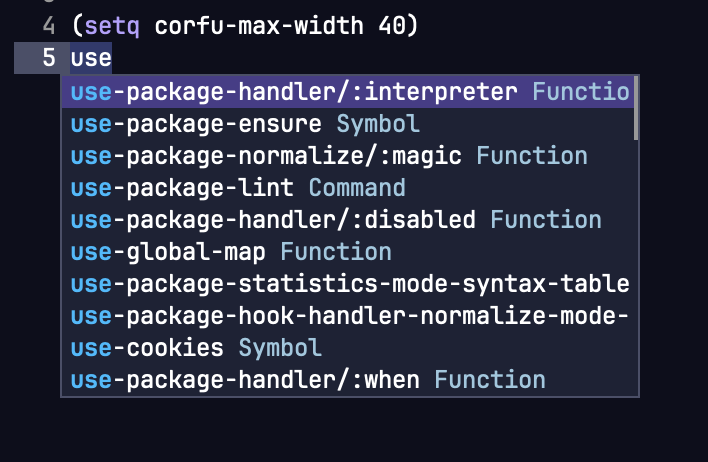 [^2]


There are a number of other reasons for the rejection of the change I'm sure,
but they are not about techincal merit, of which I'll stick to here.

In short, I regret not publishing all these improvements as a separate package
first in order to gather some community feedback before attempting to land
multiple medium size changes. This is my mistake, of which I'm fixing by
publishing this new package.


[^2]: While I do see some utility in this coincidence due to higher information
  density, after some consideration, I have decided against it and its
  right-align-at-best-effort variant for now. The reason is downstream Elisp
  programs rely on the output of `corfu--format-candidate`. It's easy to pad and
  format 3 columns into a list of strings in imaginative ways, it's much harder
  to parse and reformat irregularly formatted strings without abusing text
  properties, or worse, using a parser. The design space for completion popup
  column alignment is actually quite large. I may revisit some options to chain
  formatters after looking at how other IDEs design their completion popups. For
  now, I think keeping the formatted output simple and predictable is the best
  course of action as it keeps the API clean.


### Were there any issues filed on `corfu` regarding the issued found?

Some of the problems illustrated here had been raised, but I did not file any
issues.

This is to honor `corfu` author's request to not file many issues based on a
private conversation. Regardless, I think you'll see a pattern on how he deals
with issues by glancing over his repos. I do not intend to cause any additional
stress for him.


### Will this be ported to Company?

Probably not by myself. Time is a very precious resource, and Company has
accumulated too much code bloat over the years for this to be a worthwhile
adventure for me. However, an intrepid explorer such as you may find the ideas
in this package promising. If that's the case, plese feel free to take the ideas
and/or code to do whatever you want in whatever package, provided you adhere to
the GPLv3 license.


### Will this be published on a package archive?

Eventually, likely, hopefully soon. But it'll definitely not be Gnu ELPA or
Non-Gnu ELPA despite they are technically superior than Melpa when it comes to
versioning. This is a personal choice I've made some years ago. Time is a very
precious resource for me.


### Are there bugs introduced?

Although I do not anticipate many, I do expect a few. Emacs has a lot of
different GUI frontends and they all vary to some degree. The tricks used here
may not work for you, despite adhering to the documentation to my best
effort. If you've found a bug, file an issue and I'll do my best to fix it, but
please do not file a bug against the Haiku, Andriod or MS-DOS port.


### Will this package break when `corfu` changes its API?

`corfu`'s API has been relatively stable for sometime, while I cannot control
what develops over there, I can promise as soon as something breaks, I'll fix
it. A usable, performant and correct auto-completion UI is very important to me
as I use it every day, maintaining stability in this package is a priority for
me by default.


### Is it slow?

Is 300 FPS in the average case slow? It's slower than vanilla `corfu`, but I
doubt you'll notice it on any computers purchased in the last 4 years or
so. Your mileage may vary of course. However, if Linux is your OS, you are in
luck, because your window managers, compositors and whatnot are much faster than
macOS', which is what the above benchmark number is based on.


### Which version of Emacs does this package support?

Emacs 29. It's possible to adapt this package for Emacs < 29 without much
effort, but ideally the responsibility lies in
[compat](https://github.com/emacs-compat/compat) in that it needs to provide a
`string-pixel-width`. However, I expect the performance will take some hit if
you aren't on Emacs >= 29.
